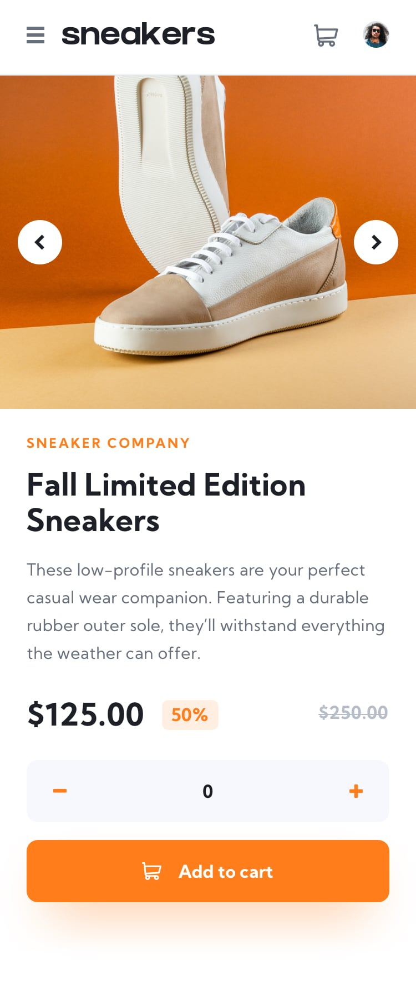

## Welcome! 👋

## Ecommerce Website

Welcome to the Ecommerce Website project! This is a responsive and interactive website that showcases and sells various products. Users can explore product images, view product details, add products to their cart, and proceed to checkout. The website provides a seamless shopping experience for customers.

## Features
 - Responsive design to ensure optimal viewing experience across devices
 - Navigation menu with access to different sections of the website
 - Product images with the ability to switch between different image views
 - Cart functionality to add and manage selected products
 - Checkout process to complete the purchase
 - Interactive elements and animations to enhance user experience

## Technologies Used

 - HTML: The structure and content of the website
 - CSS: Styling and layout of the website
 - JavaScript: Interactive functionality and dynamic behavior

## Demo

You can try out the live demo of the multi-step form here : https://mariamgogaladze.github.io/ecommerce-product-page-main/

## Usage

1. Open the `index.html` file in your web browser.
2. Explore the website and marvel at the stunning visual effects and animations.
3. Observe the captivating transition between different product images and thumbnails.
4. Click on the product thumbnails to experience the dynamic image display.
5. Add the product to your cart and witness the total price calculation.
6. Remove the product from the cart and add it again to see the update in real-time.
7. Clean the cart to start fresh and repeat the process with other products.

## Contributing

Contributions are welcome! If you find any issues or have suggestions for improvement, please open an issue or submit a pull request. Make sure to follow the existing code style and guidelines.

## Contact

For any inquiries or questions, feel free to contact [Mariami] at [gogaladzemariam8@gmail.com].

